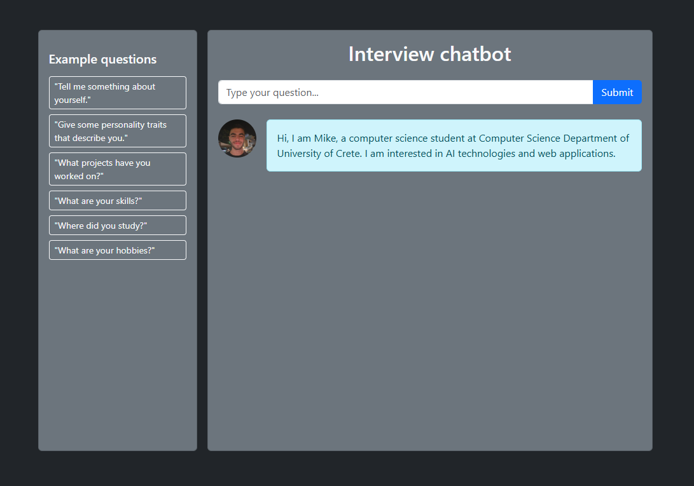

# Resume Chatbot

A web application simulating an interview, that gets a question(about me) from the user, searches in it for a list of keywords, and responds according to my resume.



## Description

**Backend:** 
- api.py : api server with a single endpoint
- keyword_mapper.py : backend chat logic
- keywords.txt : keywords for responses
- requirements.txt : required python libraries

Api server has been implemented with python fastAPI library. There is an async endpoint to serve the user requests and provide response for the chat.
Keywords from the user query are matched with a list of predefined keywords and the answer that represents the mathced keywords is returned.


**Frontend:** 
- other npm files
- src:
  - assets: web page assets
  - api.js: connection with api server
  - App.jsx: web page code
  - main.jsx:  application root

The api server is connected to the web page via axios library. The web page posts the user's question to the api, recieves the answer and displays it to the user. Also the app provides some sample questions, which the user can click on to get their answers.


**Future improvements:** 

This application could be optimized by implementing these features:
- More "pythonic" approach at keyword_mapper.py, by using dictionaries
- UI optimization
- Streaming output for "AI" responses
- Recognise the keywords even if they are mispelled in the user query (with fuzzy search)
- Maintain chat history
- LLM usage for more accurate dynamic answers

**Execution instructions (Windows):**

Setup backend folder:
```bash
python -m venv venv
./venv/Scripts/activate
pip install -r requirements.txt
```
Run api server:
```bash
uvicorn api:app --reload
```

Setup frontend folder (Ensure you have downloaded node.js):

At main folder:
```bash
npm create vite@latest frontend --template react
cd frontend
npm install
npm install axios
npm install bootstrap
```
Run application:
```bash
npm run dev
```

